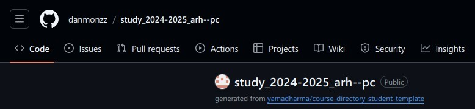

---
## Front matter
title: "Лабораторная работа №2"
subtitle: "истема контроля версий Git"
author: "Маев Даниил Егорович"

## Generic otions
lang: ru-RU
toc-title: "Содержание"

## Bibliography
bibliography: bib/cite.bib
csl: pandoc/csl/gost-r-7-0-5-2008-numeric.csl

## Pdf output format
toc: true # Table of contents
toc-depth: 2
lof: true # List of figures
lot: true # List of tables
fontsize: 12pt
linestretch: 1.5
papersize: a4
documentclass: scrreprt
## I18n polyglossia
polyglossia-lang:
  name: russian
  options:
	- spelling=modern
	- babelshorthands=true
polyglossia-otherlangs:
  name: english
## I18n babel
babel-lang: russian
babel-otherlangs: english
## Fonts
mainfont: IBM Plex Serif
romanfont: IBM Plex Serif
sansfont: IBM Plex Sans
monofont: IBM Plex Mono
mathfont: STIX Two Math
mainfontoptions: Ligatures=Common,Ligatures=TeX,Scale=0.94
romanfontoptions: Ligatures=Common,Ligatures=TeX,Scale=0.94
sansfontoptions: Ligatures=Common,Ligatures=TeX,Scale=MatchLowercase,Scale=0.94
monofontoptions: Scale=MatchLowercase,Scale=0.94,FakeStretch=0.9
mathfontoptions:
## Biblatex
biblatex: true
biblio-style: "gost-numeric"
biblatexoptions:
  - parentracker=true
  - backend=biber
  - hyperref=auto
  - language=auto
  - autolang=other*
  - citestyle=gost-numeric
## Pandoc-crossref LaTeX customization
figureTitle: "Рис."
tableTitle: "Таблица"
listingTitle: "Листинг"
lofTitle: "Список иллюстраций"
lotTitle: "Список таблиц"
lolTitle: "Листинги"
## Misc options
indent: true
header-includes:
  - \usepackage{indentfirst}
  - \usepackage{float} # keep figures where there are in the text
  - \floatplacement{figure}{H} # keep figures where there are in the text
---

# Цель работы

Целью работы является изучить идеологию и применение средств контроля версий. При-
обрести практические навыки по работе с системой git.

# Выполнение лабораторной работы

1. Сначала сделаю предварительную конфигурацию git. Открываю терминал и ввожу команды, указав имя и email владельца репозитория:

{#fig:001 width=70%}

2. Настраиваю utf-8 в выводе сообщений git: 

{#fig:002 width=70%}

3. Задаю имя начальной ветки (будем называть её master)

{#fig:003 width=70%}

4. Ввожу параметр autocrlf и параметр safecrlf:

{#fig:004 width=70%}

5. Для последующей идентификации пользователя на сервере репозиториев необходимо сгенерировать пару ключей :приватный и открытый.

{#fig:005 width=70%}

6. После генерации ключа, загружаю открытый ключ, скопировав из локальной консоли в буфер обмена. Вставляю ключ в появившееся на сайте поле и указываю для ключа имя «Tittle»

{#fig:006 width=70%}

7. Открываю терминал и создаю каталог для предмета «Архитектура компьютеров»

{#fig:007 width=70%}

8. Открываю терминал и создаю каталог для предмета «Архитектура компьютеров»

{#fig:008 width=70%}

9. Открываю терминал и захожу в каталог курса. Клонирую созданный репозиторий

{#fig:009 width=70%}

10. Перехожу в каталог курса

{#fig:010 width=70%}

11. Удаляю лишние файлы и создаю необходимые каталоги

{#fig:011 width=70%}

12. Отправляю файлы на сервер

{#fig:012 width=70%}

{#fig:013 width=70%}

13. Проверяю правильность создания иерархии рабочего пространства в локальном репозитории и на странице github
# Выводы

Я изучил идеологию и применение средств контроля версий, и приобрел практические навыки при работе с системой Git

